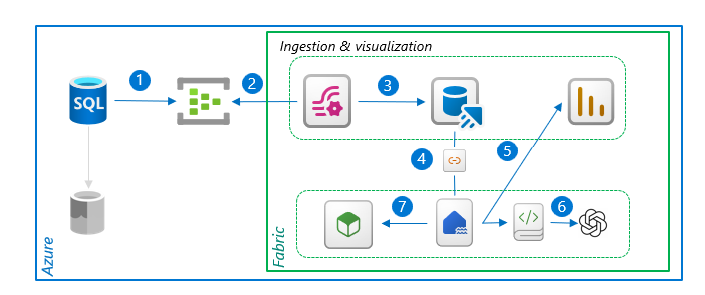

## Overview 
[<-Back](./Readme.md)

### Solution overview
The solution proposed involves the collection of **SQL audit logs** and their near real-time streaming in a simple way, into **Microsoft Fabric** thanks to its simplicity

This efficient process ensures that logs are stored systematically and securely.
Furthermore, the solution offers additional capabilities that are critical for data analysis and management.

Thanks to Fabric's capabilities, include the ability to analyze **audit events with LLM** and the compatibility with various data scientist tools. 

This solution, therefore, not only streamlines the data collection process but also enhances data utility, making it a valuable addition to any data management strategy.

### Architecture

**1.** SQL Engine generate audit and is configured to send to Event Hub

**2.** Eventstream is connected to eventhub
   
**3.** KQL database ingest data from eventstream

**4.** Through shortcut, data are available into lakehouse

**5.** Reports can be generated leveraging semantic model provided by lakehouse

**Data availability on lakehouse, unlock several capabilities**

**6.** Leverage LLM

**7.** Leverage Fabric’s Data science tools

### Components

**SQL Database:** Generate natively audit file source

**Event Hub:** Can natively collect audit file in binary format and send events downstream

**Event Stream:** Can natively connect to eventhub and send data to storage engine

**KQL Database:** Can natively connect store events sent by upstream components

**Power BI Report:** Can natively connect to storage engine and provide reporting

**Lakehouse:** Through the shortcut feature, events can be analyzed from the lakehouse using spark engine

**Notebook:** Notebook feature enable you to interact with LLM engine

**Model:** Fabric provide complete Data Science Experience

[<-Back](./Readme.md)