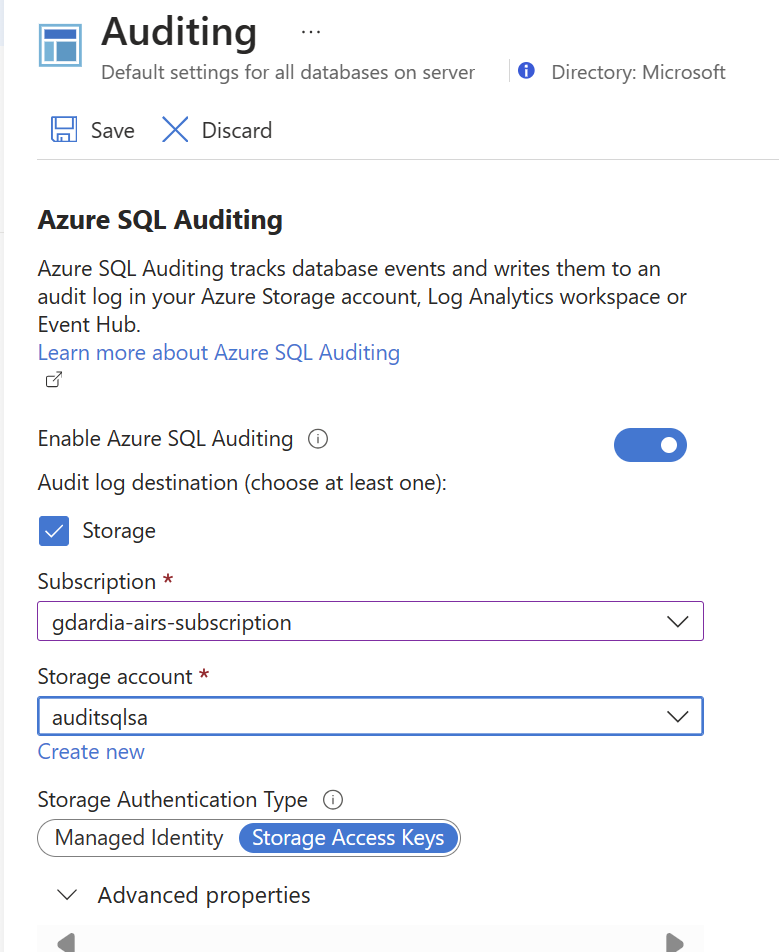
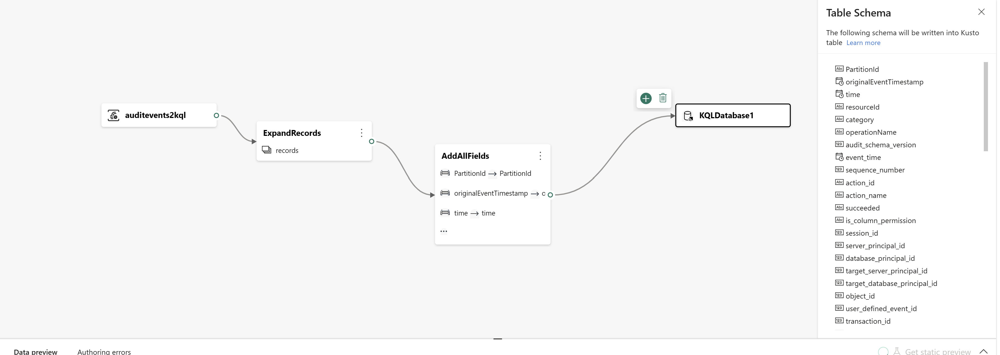

## Configuration
[<-Back](./Readme.md)

### Azure Resources configuration
For testing purpose you could create SQL Database loading an  example.

**Through audit setting**

- Configure database to send audit log to 
  - Storage account

  - Eventhub

**REMEBER TO SAVE**

To simplify configuration process we could  perform some activity in order to generate some log to gather from eventstream

### **Fabric configuration**

- connect eventsream to eventhub
  
- select ADX database as destination 
  
- provide table name as destination
Put in window dialog event name table

- select "Enable preprocess"
Once selected destination, we need to configure eventsream preporcessor.

 providing following trasformation

 **Expandrecords** to expand arrary 

 **Manage Fields**  To flatten json and report to one level all fields provided by the audit log
 

- From **ADX** page enable *"visible to lakehouse"* switch
  

- add shortcut from lakehouse to ADX
  
  
  

Final evenstream configuration

[<-Back](./Readme.md)