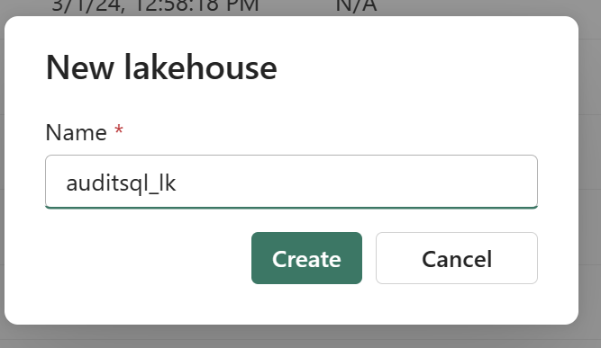

## Environment
[<-Back](./Readme.md)

Before starting we need to some Cloud resources.
I proposed some naming convention but feel free to use
one that fit with your environment.

Resource Type | Purpose | Name | Kind 
---|------------|---|---
Storage account | Store audit log|*\<PREFIX\>auditlogsa* | Azure
Eventhub (namespace and hub) | Create infrastrutcutre to collect events |*\<PREFIX\>auditeh* | Azure
Evenstream | Collect RT audit events |  *\<PREFIX\>auditcollect-es*| Fabric
Data Explorer | Store events |*\<PREFIX\>audievent-adx* | Fabric
LakeHouse | Store events |*\<PREFIX\>sql_lkh | Fabric

I'll use following names using this prefix

**PREFIX:** audit

Following entire resource list

Resource Type |  Name  
---|------------|
Resource group | **audit-rg**
Storage account | **auditsqlsa**
Eventhub (namespace) |**auditsql-eh**
Eventhub (eventhub) |**auditlogfile**
Evenstream | **auditevents2kql**
Data Explorer | **auditevents-kql**
Data Explorer (events table) | **auditevents-kql**
Fabric Workspace | **auditsql_ws**
Lakehouse | **auditsql-lkh**

### Resources creation

**Before starting resource creation, select subscription and region suitable for your environment**
*select region where all services are availables*

- **Resource group** here where I put all resources needed 
|

- **Storage account** where  all audit file coming from  Azure SQL databases are stored. Feel free to select Storage account's option best for you
  

- **Eventhub namespace**

- **Eventhub** to send audit file 
  

- **shared access policy** to use for connection
could be useful to create into Event hub Shared access policy to use to access to event hub
 

-----

### FABRIC ITEMS

**Fabric Workspace**

**Evenstream**

**Data Explorer instance**

**Lakehouse**

[<-Back](./Readme.md)