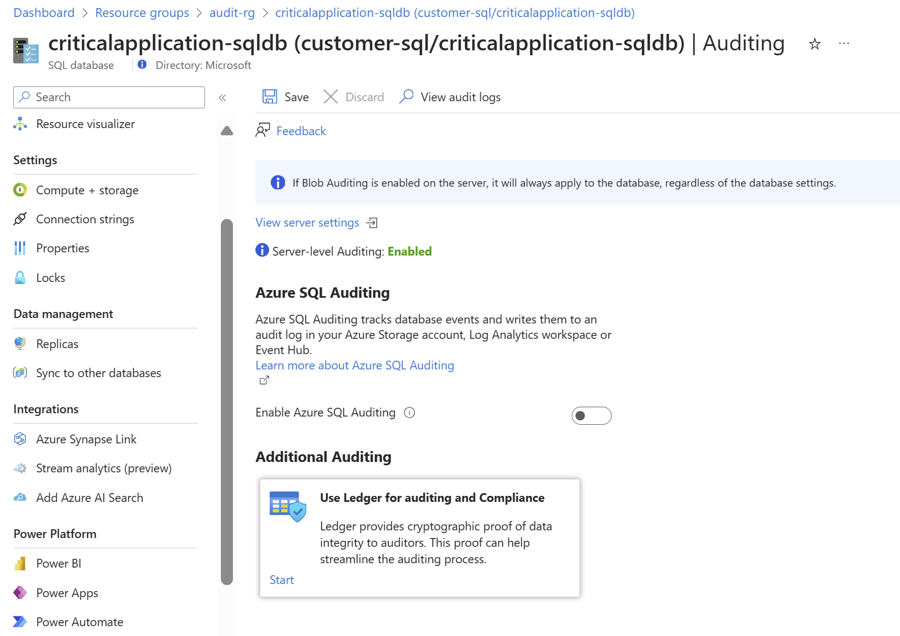
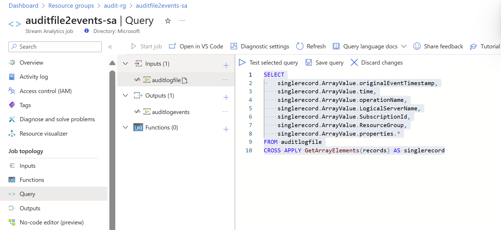

## Environment
[<-Back](Readme.md)


Before starting we need to some Cloud resources.
I proposed some naming convention but feel free to use
one that fit with your environment.


Resource Type | Purpose | Name | Kind 
---|------------|---|---
Storage account | Store audit log|*\<PREFIX\>auditlogsa* | Azure
Eventhub (namespace and hub) | Create infrastrutcutre to collect events |*\<PREFIX\>auditeh* | Azure
Stream analytics job | Undecode xel binary file to json events |*\<PREFIX\>unwrapevent-ed* | Azure
Evenstream | Collect RT audit events |  *\<PREFIX\>auditcollect-es*| Fabric
Data Explorer | Store events |*\<PREFIX\>audievent-adx* | Fabric

I'll use following names using this prefix

**PREFIX:** audit

Following entire resource list

Resource Type |  Name  
---|------------|
Resource group | **audit-rg**
Storage account | **auditsqlsa**
Eventhub (namespace) |**auditsql-eh**
Eventhub (eventhub) |**auditlogfile**
Eventhub (eventhub) |**auditlogevents**
Stream analytics job | **auditfile2events-sa**
Evenstream | **auditevents2kql**
Data Explorer | **auditevents-kql**
Data Explorer (events table) | **auditevents-kql**
Fabric Workspace | **auditsql_ws**


### Resources creation

**Before starting resource creation, select subscription and region suitable for your environment**
*select region where all services are availables*

- **Resource group** here where I put all resources needed


- **Storage account** where  all audit file coming from  Azure SQL databases are stored. Feel free to select Storage account's option best for you
  


- **Eventhub namespace**


- **Eventhub** to send audit file in *.xel format
  


- **Eventhub** to send events in json format


could be useful to create into Event hub Shared access policy to use to access to event hub


At the end of creation phase Event Hub should appear like this


- **Stream analytics job** to convert xel file to json events
  


-----


### FABRIC ITEMS

**Farbic Workspace**


**Evenstream**


**Data Explorer instance**


-----

### Resources configuration
For testing purpose you could create SQL Database loading an  example.

**Through audit setting**


- Configure database to send audit log to 
  - Storage account


  - Eventhub


**REMEBER TO SAVE**



We could perform some acitivity in order to generate some log


**Stream analytics configuration**

**- add input**


**- add output**


**- define query**


```    
SELECT
	singlerecord.ArrayValue.originalEventTimestamp,
    singlerecord.ArrayValue.time,
    singlerecord.ArrayValue.operationName,
    singlerecord.ArrayValue.LogicalServerName,
    singlerecord.ArrayValue.SubscriptionId,
    singlerecord.ArrayValue.ResourceGroup,
    singlerecord.ArrayValue.properties.*
FROM auditlogfile
CROSS APPLY GetArrayElements(records) AS singlerecord
```


**Data explorer table**

