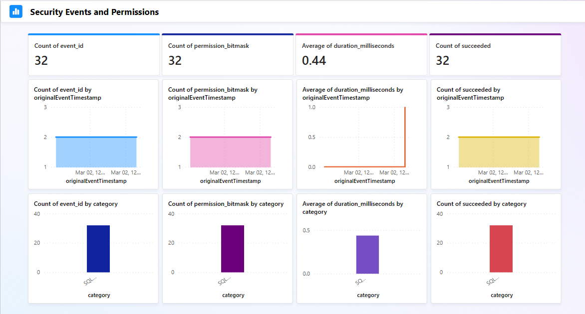

## Reporting
[<-Back](./Readme.md)

With data into lakehouse, we are free to create whatevere report.

Following few example created from scratch, leveraging Fabric Copilot

#### Audit Events Over Time

#### Audit Events Overview

#### Audit Events Overview

[<-Back](./Readme.md)